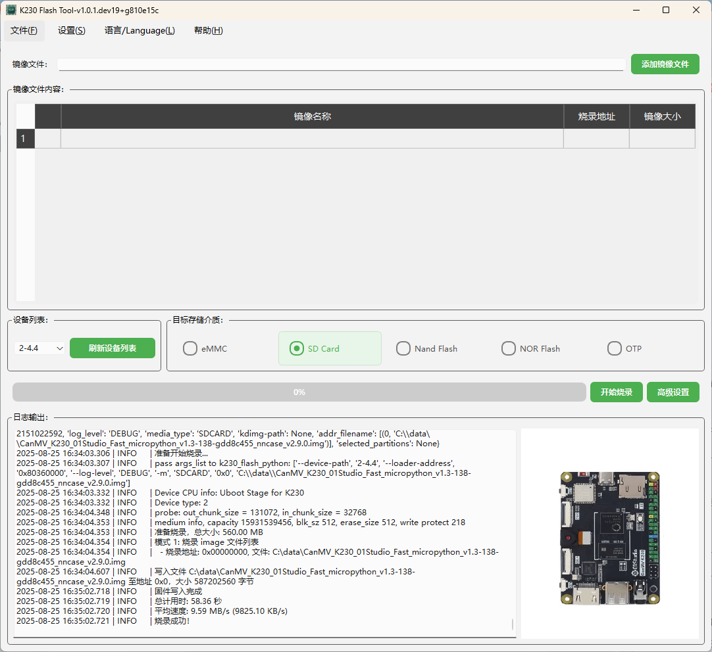

# **K230 Flash GUI User Manual**  

## **1. Software Overview**  

**K230 Flash GUI** is a tool for flashing firmware to K230 development boards, providing both **single flash** and **batch flash** modes, and supporting multiple storage media (eMMC, SD Card, Nand Flash, NOR Flash, OTP).  

This tool is based on the **k230-flash** library with a friendly GUI interface. If you need to use **command-line tools** for automated flashing workflows, you can directly call the **k230-flash** library without GUI interaction.  

## **2. System Requirements**  

- **Operating System**: Windows / Linux  
- **Python Version**: Python 3.8 and above  
- **Dependencies**: PySide6, loguru, gitpython, k230-flash, etc. (see `requirements.txt` for details)  

## **3. Installation**  

### **3.1 Install Python and Dependencies**  

1. **Install Python 3.8 or higher** and ensure `pip` is installed.  
2. Run the following command to install dependencies:  

   ```shell
   pip install -r requirements.txt
   ```  

### **3.2 Run the Software**  

Launch the GUI by running the following command in terminal:  

```shell
python main.py
```

## **4. Development Board Hardware Setup**  

Before flashing, you need to put the **K230 development board** into **USB Boot mode**:  

1. **Method 1** (Recommended):  
   - **Hold down** the **BOOT** button on the development board, then **plug in the USB cable** to power on the board.  

2. **Method 2**:  
   - When the board is already powered on, **hold down** the **BOOT** button, then **press and hold the RESET** button, then **release RESET**, and finally **release BOOT**.  

After entering **USB Boot mode**, you can check in **Device Manager** (Windows) or `lsusb` (Linux) to see if the **"K230 USB Boot Device"** is recognized.  

## **5. Driver Installation (Windows)**  

**K230 Flash GUI** uses **libusb** for USB device communication. On Windows, you need to install **drivers**. We recommend using the **Zadig** tool:  

1. **Download Zadig** ([https://zadig.akeo.ie/](https://zadig.akeo.ie/)).  
2. **Open Zadig**, select **Options > List All Devices**, then find **K230 USB Boot Device**.  
3. In the **Driver** option, select **WinUSB** (if already installed, you can choose to reinstall).  
4. Click **Install Driver** and wait for installation to complete.  
5. After installation, you can see **K230 USB Boot Device (WinUSB)** in **Device Manager**.  

## **6. User Interface**  

The software provides an intuitive graphical interface, including menu bar, main interface, and log area.



### **6.1 Menu Bar**  

- **File (F)**: Provides exit function (shortcut `Ctrl+Q`).  
- **Settings (S)**: Select flash mode (single / batch) and advanced settings.  
- **Language (L)**: Supports Chinese / English switching.  
- **Help (H)**: Contains "About" information and user manual.  

### **6.2 Main Interface**  

- **Image File Selection**: Select `.bin`, `.img`, `.kdimg` files.  
- **Target Storage Media**: Supports eMMC, SD Card, Nand Flash, NOR Flash, OTP.  
- **Progress Bar and Log**: Shows flashing progress and log information.  

## **7. Flashing Process**  

### **7.1 Select Flash Mode**  

In **Settings > Flash Mode**, choose:  

- **Single Flash Mode**: Flash a single device individually.  
- **Batch Flash Mode**: Flash multiple devices simultaneously (this feature is still under development).  

### **7.2 Select Firmware File**  

1. Click the "Add Image File" button to select `.bin`, `.img`, or `.kdimg` files.  
2. `.img` files will be parsed into multiple partitions, and users can check the parts they want to flash.  

### **7.3 Select Target Storage Media**  

Select **eMMC / SD Card / Nand Flash / NOR Flash / OTP** in the media options.  

### **7.4 Start Flashing**  

1. **Confirm the image file, target storage media, and flash address**.  
2. Click the **"Start Flash"** button, and the progress bar will show real-time flashing progress.  
3. After flashing is complete, the log area will show **"Flash Complete!"**.  

## **8. Command-line Flashing with k230-flash**  

If you need to flash from **command line** or **automation scripts**, you can directly use the `k230-flash` library. For example:  

```python
from k230_flash.main import main

# Example: Flash a .kdimg file to SDCARD with auto-reboot
args = [
    "/path/to/your/firmware.kdimg",
    "--media-type", "SDCARD",
    "--auto-reboot"
]

# Call the main function with argument list
main(args)
```

## **9. Advanced Settings**  

You can configure advanced options in **Settings > Advanced Settings**, such as adjusting flash parameters, modifying flash addresses, etc.  

## **10. Language Switching**  

Select **Chinese** or **English** in the **Language** menu, and the interface language will switch automatically.  

## **11. Troubleshooting**  

### **11.1 Interface Not Responding / Flash Failure**  

- Ensure Python and PySide6 dependencies are correctly installed.  
- Connect the K230 development board and check the USB cable.  
- Check the log area for error messages and try flashing again.  

### **11.2 Language Switch Failure**  

- Ensure the `english.qm` language pack is correctly loaded.  
- Modify `language=zh-CN` or `language=en` in `config.ini`, then restart the software.
