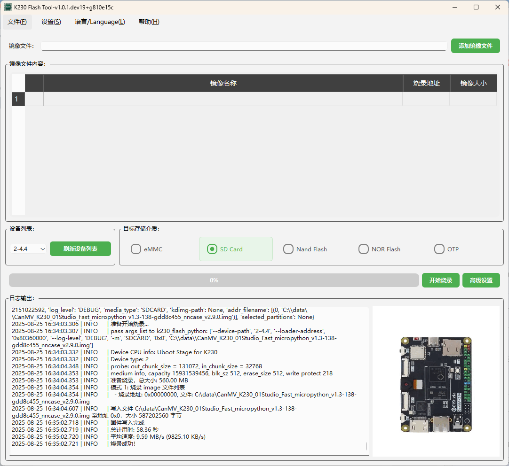

# **K230 Flash GUI 使用说明书**  

## **1. 软件概述**  

**K230 Flash GUI** 是一款用于烧录 K230 开发板固件的工具，提供 **单机烧录** 和 **批量烧录** 两种模式，并支持多种存储介质（eMMC、SD Card、Nand Flash、NOR Flash、OTP）。  

本工具基于 **k230-flash** 库进行封装，提供了更友好的 GUI 界面。如果希望使用 **命令行工具** 开发自动化烧录流程，可以直接调用 **k230-flash** 库，无需 GUI 交互。  

## **2. 环境要求**  

- **操作系统**：Windows / Linux  
- **Python 版本**：Python 3.8 及以上  
- **依赖库**：PySide6、loguru、gitpython、k230-flash 等（详细依赖见 `requirements.txt`）  

## **3. 安装方法**  

### **3.1 安装 Python 及依赖库**  

1. **安装 Python 3.8 及以上版本**，并确保 `pip` 已安装。  
2. 运行以下命令安装依赖库：  

   ```shell
   pip install -r requirements.txt
   ```  

### **3.2 运行软件**  

在终端运行以下命令启动 GUI：  

```shell
python main.py
```

## **4. 开发板硬件准备**  

在烧录前，需要让 **K230 开发板** 进入 **USB Boot 模式**，步骤如下：  

1. **方法 1**（推荐）：  
   - **先按住** 开发板上的 **BOOT** 按键，然后 **插入 USB 线** 给开发板上电。  

2. **方法 2**：  
   - 开发板已经上电时，**先按住** **BOOT** 按键，再 **按住 RESET** 按键，然后 **松开 RESET**，最后 **松开 BOOT**。  

进入 **USB Boot 模式** 后，可以在 **设备管理器**（Windows）或 `lsusb`（Linux）中查看是否识别到 **"K230 USB Boot Device"**。  

## **5. 驱动安装（Windows）**  

**K230 Flash GUI** 使用 **libusb** 进行 USB 设备通信。在 Windows 下，需要安装 **驱动程序**，推荐使用 **Zadig** 工具：  

1. **下载 Zadig**（[https://zadig.akeo.ie/](https://zadig.akeo.ie/)）。  
2. **打开 Zadig**，选择 **Options > List All Devices**，然后找到 **K230 USB Boot Device**。  
3. 在 **Driver** 选项中，选择 **WinUSB**（如果已经安装，可以选择重新安装）。  
4. 点击 **Install Driver**，等待安装完成。  
5. 安装完成后，可以在 **设备管理器** 中看到 **K230 USB Boot Device（WinUSB）**。  

## **6. 界面介绍**  

软件提供直观的图形化界面，包括菜单栏、主界面和日志区域。



### **6.1 菜单栏**  

- **文件（F）**：提供退出功能（快捷键 `Ctrl+Q`）。  
- **设置（S）**：可选择烧录模式（单机 / 批量）及高级设置。  
- **语言 / Language（L）**：支持中文 / 英文切换。  
- **帮助（H）**：包含“关于”信息和使用说明文档。  

### **6.2 主界面**  

- **镜像文件选择**：可选择 `.bin`、`.img`、`.kdimg` 文件。  
- **目标存储介质**：支持 eMMC、SD Card、Nand Flash、NOR Flash、OTP。  
- **进度条与日志**：显示烧录进度及日志信息。  

## **7. 烧录流程**  

### **7.1 选择烧录模式**  

在 **设置 > 烧录模式** 中选择：  

- **单机烧录模式**：单独对一台设备进行烧录。  
- **批量烧录模式**：对多台设备同时烧录（此功能尚在开发中）。  

### **7.2 选择固件文件**  

1. 点击“添加镜像文件”按钮，选择 `.bin`、`.img` 或 `.kdimg` 文件。  
2. `.img` 文件会解析出多个分区，用户可勾选需要烧录的部分。  

### **7.3 选择目标存储介质**  

在介质选项中选择 **eMMC / SD Card / Nand Flash / NOR Flash / OTP**。  

### **7.4 开始烧录**  

1. **确认镜像文件、目标存储介质及烧录地址**。  
2. 点击 **“开始烧录”** 按钮，进度条会实时显示烧录进度。  
3. 烧录完成后，日志区域会提示 **“烧录完成！”**。  

## **8. 使用 k230-flash 进行命令行烧录**  

如果需要在 **命令行** 或 **自动化脚本** 中进行烧录，可以直接使用 `k230-flash` 库。例如：  

```python
from k230_flash.main import main

# 示例：烧录一个 .kdimg 文件到 SDCARD 并自动重启
args = [
    "/path/to/your/firmware.kdimg",
    "--media-type", "SDCARD",
    "--auto-reboot"
]

# 调用主函数，传入参数列表
main(args)
```

## **9. 高级设置**  

可在 **设置 > 高级设置** 进行配置，如调整烧录参数、修改烧录地址等。  

## **10. 语言切换**  

在 **语言 / Language** 菜单中选择 **中文** 或 **English**，界面语言会自动切换。  

## **11. 常见问题**  

### **11.1 界面未响应 / 烧录失败**  

- 确保 Python 及 PySide6 依赖库已正确安装。  
- 连接 K230 开发板并检查 USB 线缆。  
- 查看日志区域是否有错误信息，并尝试重新烧录。  

### **11.2 语言切换失败**  

- 确保 `english.qm` 语言包已正确加载。  
- 在 `config.ini` 中修改 `language=zh-CN` 或 `language=en`，然后重启软件。
